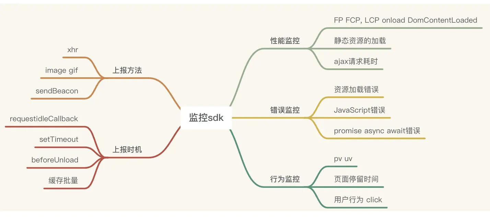
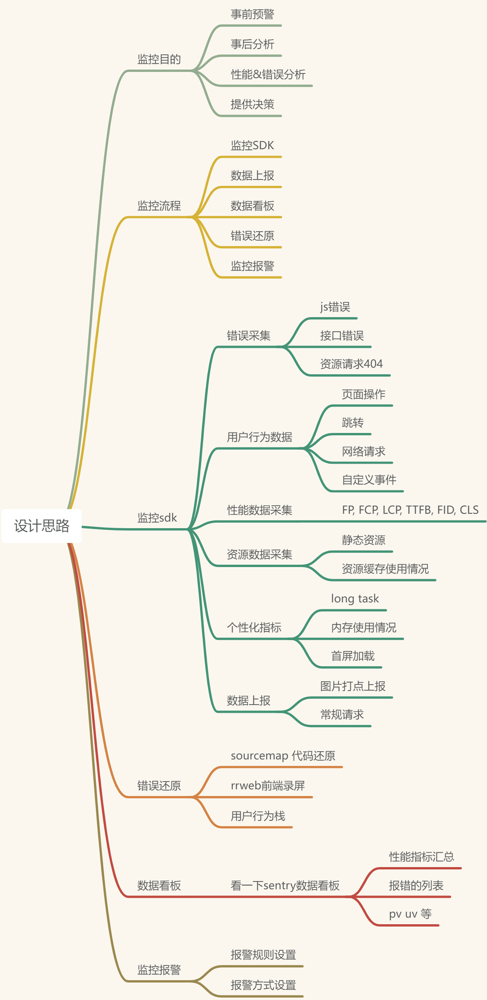

# 前端sdk
## 大纲图片

## 已有收费产品对比
### 比较有名的产品
1. sentry： https://sentry.io/welcome/
2. 神策：https://www.sensorsdata.cn/
3. 听云：https://www.tingyun.com/
### 监控平台包括三个部分
1. 数据采集与上报
2. 数据存储和分析
3. 数据展示、数据报警和监控
### 设计思路

### 控制台统计代码
1. FCP ≤ 1秒:首次内容绘制时间 (First Contentful Paint)
2. LCP ≤2 秒:最大内容绘制时间 (Largest Contentful Paint)
3. FID (first input delay) 
4. 首次内容绘制时间,FCP,LCP
## 错误监控
1. 错误分类
   1. 语法错误：编译时发现
   2. 运行时错误：方法/变量不存在
   3. 逻辑错误：错误判断条件
2. 捕获方式
